# Automated Contractor Offboarding with Microsoft Entra ID Governance

**Status:** ✅ Built and tested

## Video Walkthrough

▶️ [Watch the walkthrough on Loom](https://www.loom.com/share/b8a0be82bc0249129ed462e258ca96a5)

## Project Overview

A contractor leaves in March. In June, their login still works. Nobody decided to leave that account open; it just never got closed, because offboarding depended on someone remembering to do it.

In this lab I built identity governance so access expires by design instead of by memory. Contractor access is granted through a time-boxed access package with manager approval and quarterly reviews, a Lifecycle Workflows leaver process removes access and disables the account on the leave date, admin rights are eligible through PIM instead of permanent, and a Conditional Access policy requires MFA for admin roles. The identity objects are deployed with Terraform (`azuread` provider) running as a dedicated app registration with least-privilege Graph permissions, and the lifecycle automation is built against the Microsoft Graph REST API with PowerShell.

In testing, the leaver workflow completed all three tasks with zero failures in 18 seconds: the contractor's access package assignment and group memberships were removed and the account was disabled.

### Skills Demonstrated

- Identity lifecycle management (leaver) with **Lifecycle Workflows**
- **Entitlement management**: catalogs, access packages, manager approval, and expiration
- **Access Reviews** with automatic removal of unconfirmed access
- **Privileged Identity Management (PIM)**: eligible vs. permanent role assignments, just-in-time activation settings
- **Conditional Access** in report-only mode with a break-glass exclusion
- **Non-human identity**: a dedicated app registration with scoped Microsoft Graph application permissions for automation
- Least privilege and RBAC applied to human and workload identities
- Identity-as-code with Terraform (`azuread` provider)
- Automation with the **Microsoft Graph REST API** and PowerShell

## Architecture Diagram

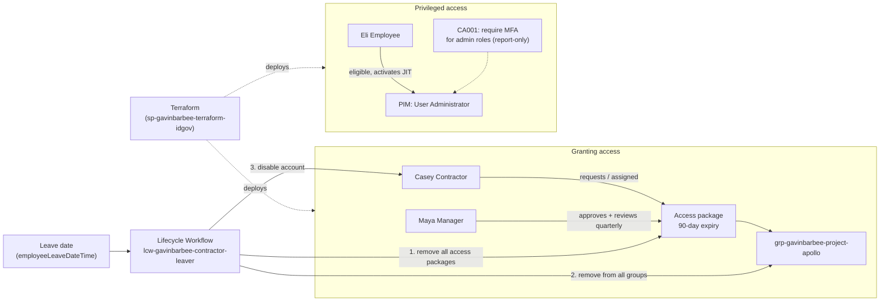

## Prerequisites

- An Entra ID tenant I control that is **not** a production tenant
- Microsoft Entra ID P2 trial (PIM, Access Reviews, entitlement management, Conditional Access)
- Microsoft Entra ID Governance trial (Lifecycle Workflows)
- A tenant-native Global Administrator account (`gavinbarbee-admin@<tenant>.onmicrosoft.com`), not a personal Microsoft account
- Security defaults turned off in the lab tenant (Conditional Access can't be used alongside them)
- Windows + VS Code + PowerShell
- Azure CLI and Terraform installed
- Microsoft Graph PowerShell authentication module:

```powershell
Install-Module Microsoft.Graph.Authentication -Scope CurrentUser
```

## Naming Conventions

| Object | Name |
|---|---|
| Tenant admin (break-glass stand-in) | `gavinbarbee-admin` |
| Terraform app registration | `sp-gavinbarbee-terraform-idgov` |
| Test users | `gavinbarbee-manager`, `gavinbarbee-employee`, `gavinbarbee-contractor` |
| Security group | `grp-gavinbarbee-project-apollo` |
| Catalog | `cat-gavinbarbee-contractor-resources` |
| Access package | `ap-gavinbarbee-contractor-project-apollo` |
| Assignment policy | `pol-gavinbarbee-contractor-90-days` |
| Conditional Access policy | `CA001-gavinbarbee-require-mfa-for-admin-roles` |
| Lifecycle workflow | `lcw-gavinbarbee-contractor-leaver` |

## Project Steps

### 1. Prepare the lab tenant

My Azure subscription was created with a personal Microsoft account, which can't manage licensing in the Microsoft 365 admin center. I created a dedicated tenant admin, `gavinbarbee-admin`, with the Global Administrator role and used it for the rest of the lab.

From the Microsoft 365 admin center (Billing → Marketplace / Purchase services), I started the **Microsoft Entra ID P2 Managed Trial** and the **Microsoft Entra ID Governance Trial** (standalone), set the admin's usage location to United States, and assigned both licenses. Then I turned off security defaults in the Entra admin center.

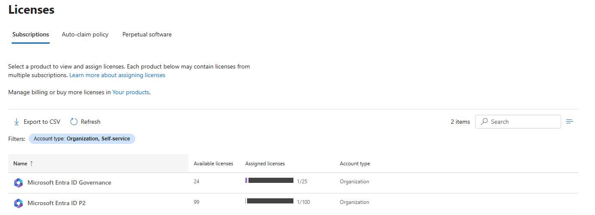
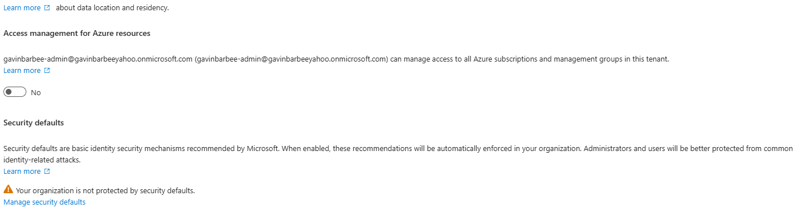

### 2. Create a dedicated identity for Terraform

The Azure CLI's sign-in token doesn't carry the Microsoft Graph scopes needed for entitlement management and PIM, so I gave Terraform its own workload identity. I created the app registration `sp-gavinbarbee-terraform-idgov`, added these Microsoft Graph **application** permissions, and granted admin consent:

| Permission | Used for |
|---|---|
| `User.ReadWrite.All` | Test users |
| `Group.ReadWrite.All` | Project Apollo group |
| `Domain.Read.All` | Looking up the tenant's initial domain |
| `EntitlementManagement.ReadWrite.All` | Catalog, access package, assignment policy |
| `RoleManagement.ReadWrite.Directory` | Activating the User Administrator role |
| `RoleEligibilitySchedule.ReadWrite.Directory` | PIM eligible assignment |
| `Policy.Read.All` + `Policy.ReadWrite.ConditionalAccess` | Conditional Access policy |
| `Application.Read.All` | Conditional Access application references |

I created a short-lived client secret and passed it to Terraform only through environment variables in the terminal session, so it never touches a file in the repo.

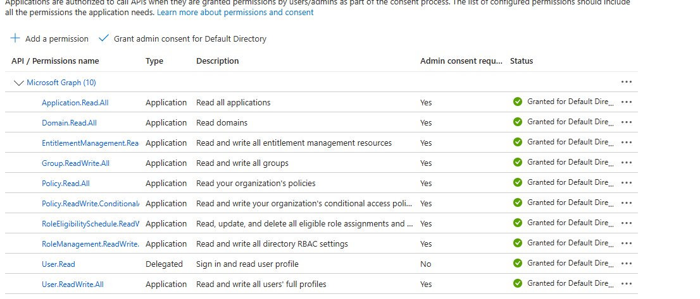

Once Terraform finished, I deleted the client secret so no long-lived credential was left on an app with these permissions. I create a fresh one only when I need to run Terraform again.

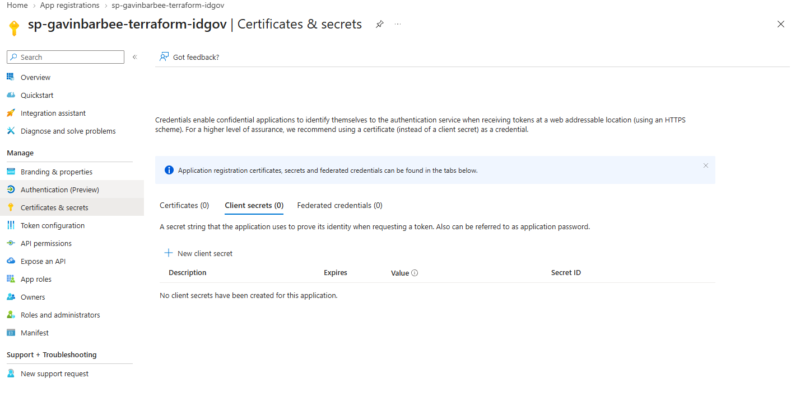

### 3. Deploy the identities and governance objects with Terraform

```powershell
$env:ARM_TENANT_ID     = '<tenant-id>'
$env:ARM_CLIENT_ID     = '<application-client-id>'
$env:ARM_CLIENT_SECRET = '<client-secret-value>'

cd terraform
Copy-Item terraform.tfvars.example terraform.tfvars   # then set tenant_id and break_glass_upn
terraform init
terraform plan "-out=main.tfplan"
terraform apply main.tfplan
```

This creates three test users (manager, employee, contractor), the Project Apollo group, the catalog, the access package and its policy (manager approval, 90-day expiry, quarterly review with `removeAccess` on timeout), the PIM eligible assignment, and the Conditional Access policy in report-only mode.

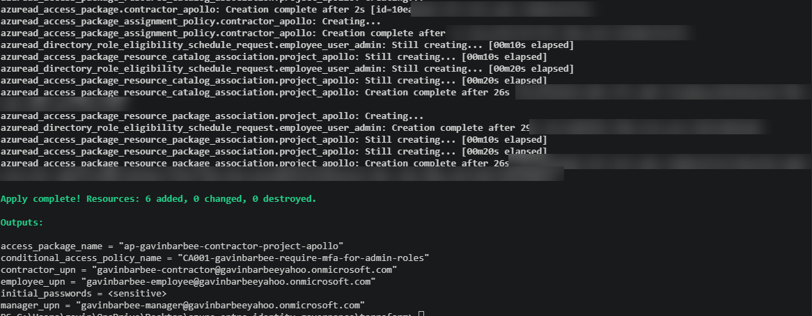

### 4. Assign the contractor through the access package

In Entitlement management → Access packages → `ap-gavinbarbee-contractor-project-apollo` → Assignments → **New assignment**, I assigned Casey Contractor using the 90-day policy. Because the policy requires manager approval, even my admin assignment went to Maya for approval. I signed in as Maya at **myaccess.microsoft.com**, approved the request, and the assignment moved to **Delivered** with an end date of December 30, 2026, 90 days out.


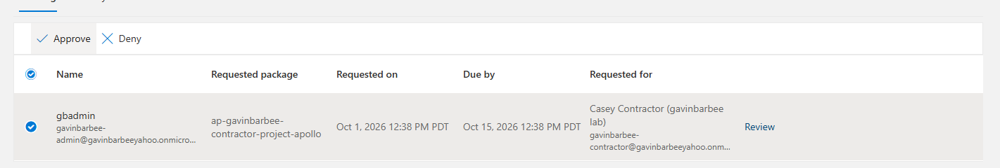
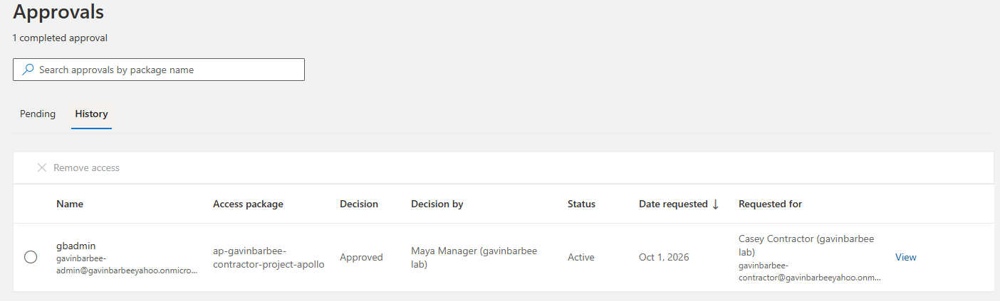
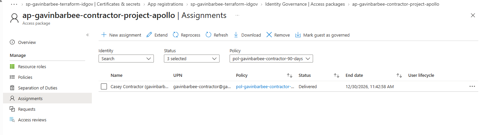

### 5. Confirm access reviews are built into the policy

On the assignment policy, I confirmed the quarterly review with Maya Manager as reviewer and access removed if the review isn't completed.

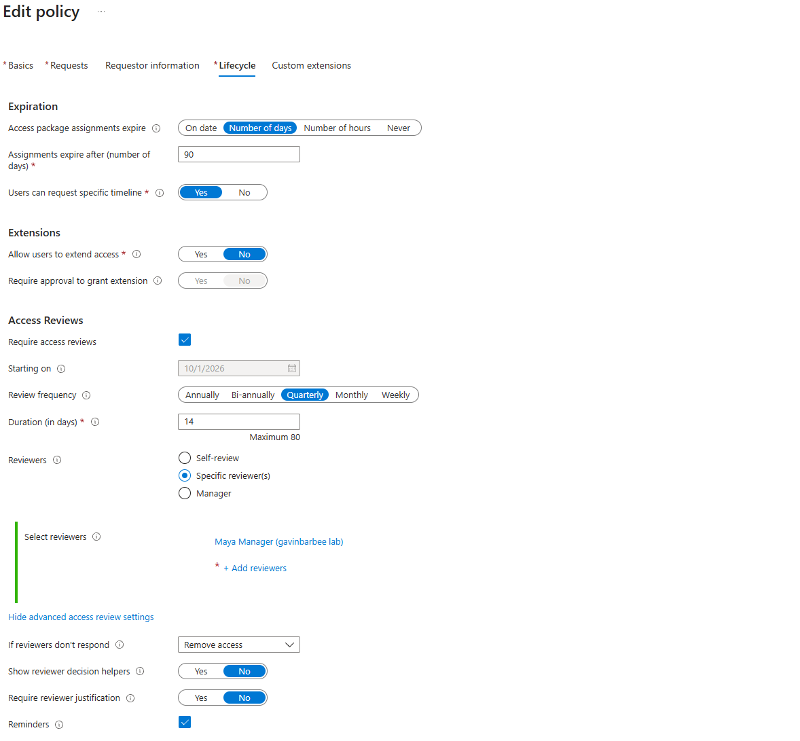

### 6. Configure PIM

In Privileged Identity Management → Microsoft Entra roles → User Administrator, Eli Employee is listed under **Eligible** with nothing under **Active**, so there are no standing admin rights. In the role settings, I set a 2-hour maximum activation, required MFA on activation, and required a justification.

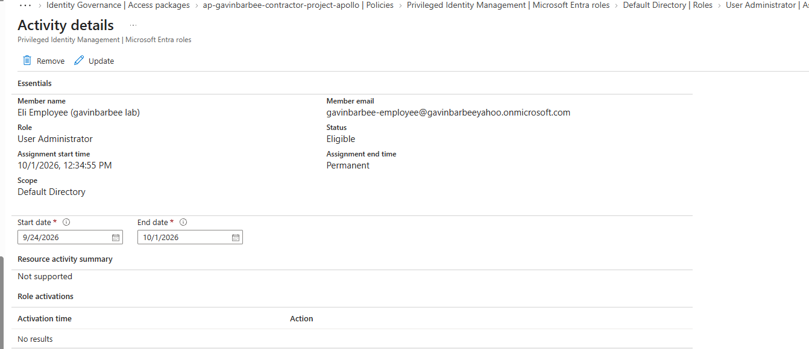
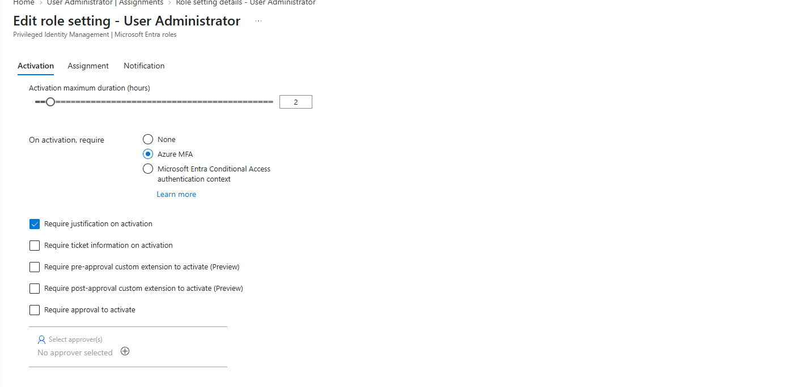

### 7. Review the Conditional Access policy

`CA001-gavinbarbee-require-mfa-for-admin-roles` targets the Global Administrator and User Administrator roles, requires MFA, excludes my break-glass stand-in, and runs in **report-only** mode so its impact shows up in the sign-in logs before it's enforced.

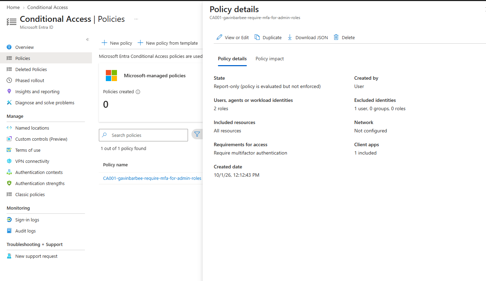

### 8. Create the leaver workflow through Microsoft Graph

```powershell
cd ..\scripts
.\01-create-leaver-workflow.ps1
```

The script signs in with a device code against my tenant, looks up the built-in leaver task definitions by name, then creates a workflow scoped to `department eq 'Contractors'`, triggered by `employeeLeaveDateTime`, with three tasks in order: remove all access package assignments, remove from all groups, disable the account.

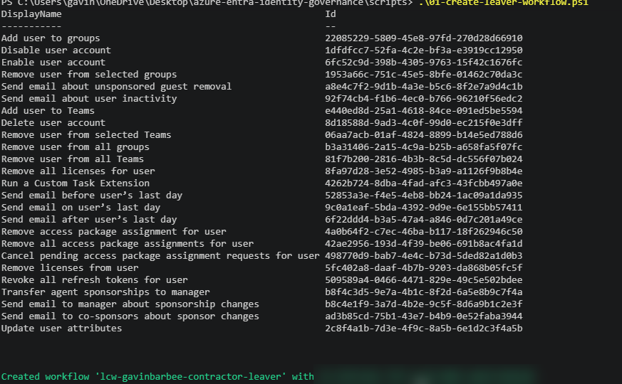

### 9. Offboard the contractor

```powershell
.\02-offboard-contractor.ps1 -UserPrincipalName gavinbarbee-contractor@<tenant>.onmicrosoft.com
```

This stamps today's date as Casey's leave date (standing in for an HR system), prints her access before offboarding, and runs the workflow on demand. The group list in this first run printed empty because the script was missing a read scope (see Troubleshooting); the delivered access package assignment in Step 4 confirms her access before the run.

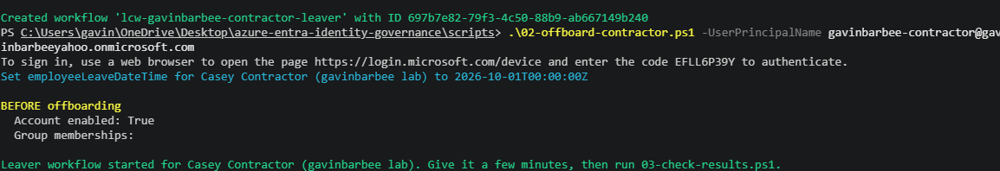

### 10. Verify the result

```powershell
.\03-check-results.ps1 -UserPrincipalName gavinbarbee-contractor@<tenant>.onmicrosoft.com
```

The workflow completed **3 of 3 tasks with 0 failures in 18 seconds**. Casey's account is disabled and she has no group memberships. The account is disabled rather than deleted on purpose: it stays available for audits or recovery, and deletion would be a separate, later workflow.

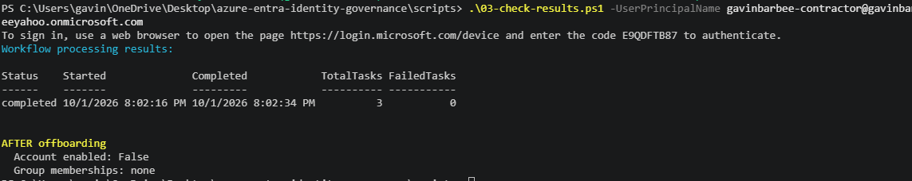
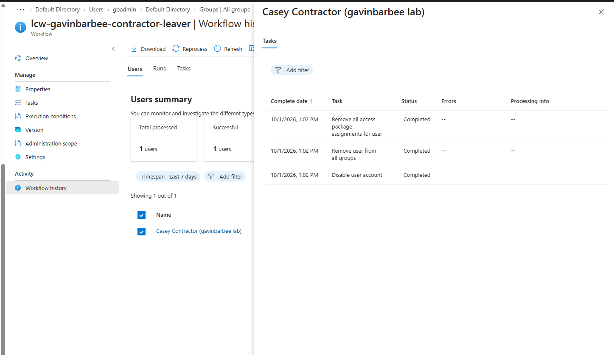

## Verification Checklist

- [x] Three test users and the Project Apollo group exist
- [x] Contractor got group access only through the access package, after manager approval, with a 90-day expiry
- [x] Access package policy has a quarterly review with auto-removal
- [x] Employee is **eligible** (not active) for User Administrator in PIM
- [x] PIM role settings require justification and MFA on activation
- [x] CA001 is report-only and excludes the break-glass stand-in
- [x] Leaver workflow exists, scoped to Contractors and triggered by leave date
- [x] After the workflow run: contractor account disabled, no group memberships, no access package assignment

## Troubleshooting

| Issue | Cause | Fix |
|---|---|---|
| "Login is not supported for consumer users without business presence" in the M365 admin center | My Azure subscription was created with a personal Microsoft account, which appears in the tenant as an external (`#EXT#`) user | Created a tenant-native Global Administrator (`gavinbarbee-admin`) and used it for the rest of the lab |
| The plain Entra ID P2 trial listing showed a price | Some catalog listings are paid plans | Used the **Entra ID P2 Managed Trial** and the standalone **Entra ID Governance Trial**, both free |
| "License assignment cannot be done for user with invalid usage location" | The admin account had no usage location | Set usage location to United States, then assigned licenses |
| `az login` said the admin account didn't exist, or signed in as the `#EXT#` personal account | The Windows sign-in prompt didn't target my tenant | `az logout`, `az account clear`, then `az login --tenant <tenant-id> --allow-no-subscriptions --use-device-code` in an InPrivate window |
| 403 creating the catalog; `PermissionScopeNotGranted` for `RoleEligibilitySchedule.ReadWrite.Directory` on the PIM request | The Azure CLI's delegated token doesn't include those Graph scopes, even for a Global Administrator | Created `sp-gavinbarbee-terraform-idgov` with scoped Graph application permissions and authenticated Terraform as the app |
| `AADSTS7000215: Invalid client secret provided` | Copied the secret's ID instead of its Value | Created a new secret and copied the Value, set in single quotes |
| Admin access package assignment stuck at "Pending approval" | The policy requires manager approval for every request, including admin assignments | Signed in as the manager at myaccess.microsoft.com and approved it |
| Scripts wouldn't run: "is not digitally signed" | Windows blocks scripts downloaded from the internet | `Get-ChildItem . \| Unblock-File` and `Set-ExecutionPolicy -Scope CurrentUser RemoteSigned` |
| `Connect-MgGraph` couldn't find the admin account | The interactive sign-in didn't target my tenant | Added `-TenantId $env:ARM_TENANT_ID -UseDeviceCode` to every `Connect-MgGraph` |
| `Connect-MgGraph : Invalid tenant id provided` | A leading space inside the quotes when setting `$env:ARM_TENANT_ID` | Re-set the variable with no spaces |
| `400 Task arguments missing or invalid` creating the workflow | My name pattern matched "Remove access package assignment for user," which requires a specific package ID | Matched "Remove all access package assignments for user" instead |
| Offboarding script printed no group memberships in the BEFORE state | Reading `memberOf` needs `GroupMember.Read.All`, which the script didn't request | Added the scope to scripts 02 and 03; confirmed membership in the portal |

## Cleanup

Recreate a client secret for the Terraform app and set the `ARM_*` environment variables first, then:

```powershell
# Delete the leaver workflow
$env:ARM_TENANT_ID = '<tenant-id>'
Connect-MgGraph -TenantId $env:ARM_TENANT_ID -UseDeviceCode -Scopes "LifecycleWorkflows.ReadWrite.All" -NoWelcome
$wf = (Invoke-MgGraphRequest GET "v1.0/identityGovernance/lifecycleWorkflows/workflows").value |
    Where-Object { $_.displayName -eq "lcw-gavinbarbee-contractor-leaver" }
Invoke-MgGraphRequest DELETE "v1.0/identityGovernance/lifecycleWorkflows/workflows/$($wf.id)"

# Remove everything Terraform created
cd terraform
terraform destroy
```

If the access package fails to delete, remove any remaining assignments in the portal and run `terraform destroy` again. Afterward, delete the `sp-gavinbarbee-terraform-idgov` app registration, close the terminal so the `ARM_*` variables are cleared, and permanently delete the test users from Deleted users. The trials end on their own after 30 days.

## Key Takeaways

- Access should expire by design, not by memory: expiration dates, leave-date triggers, and reviews close access without anyone having to remember.
- Granting through access packages instead of direct group adds is what makes clean offboarding possible, because there's one place to remove from.
- Manager approval applied even to my admin assignment, which is exactly the control an auditor wants to see.
- Eligible PIM roles mean a missed account isn't also sitting on standing admin rights.
- Disabling first and deleting later keeps the account available for audits and recovery.
- Automation needs its own governed identity: the Azure CLI token didn't carry the Graph scopes I needed, so Terraform ran as an app registration with only the permissions it required and a short-lived secret.
- In production I'd add **Revoke all refresh tokens** to the leaver workflow, since disabling an account doesn't immediately end sessions that are already signed in.

---

*Built by Gavin Barbee · [github.com/gavinbarbee](https://github.com/gavinbarbee) · Time to complete: ~2 hours*